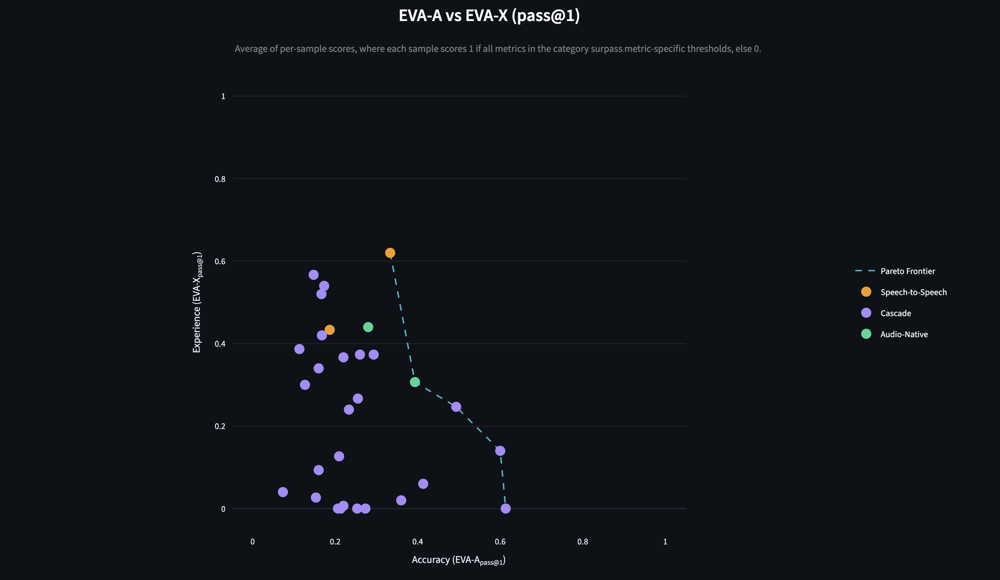
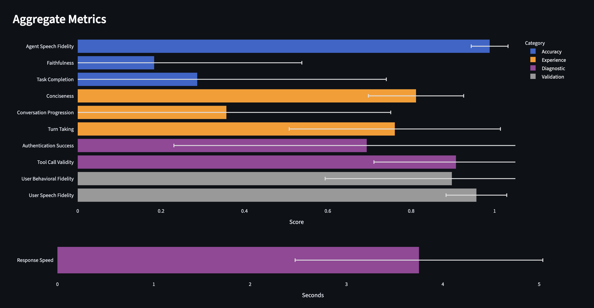
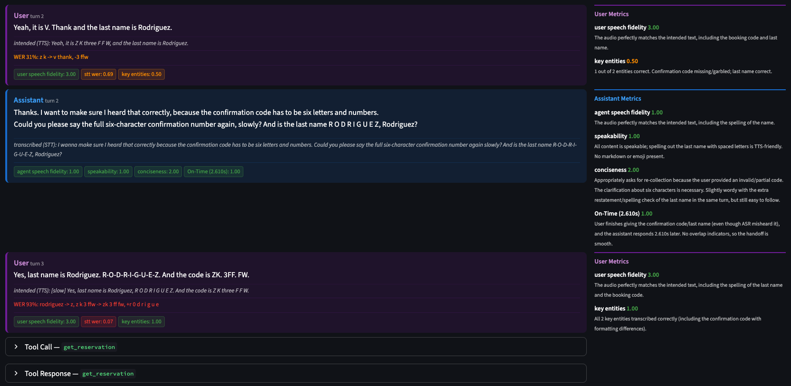

# EVA Apps

Streamlit applications for exploring EVA results.

## Analysis App

Interactive dashboard for visualizing and comparing results.

### Usage

```bash
streamlit run apps/analysis.py
```

By default, the app looks for runs in the `output/` directory. You can change this in the sidebar or by setting the `EVA_OUTPUT_DIR` environment variable:

```bash
EVA_OUTPUT_DIR=path/to/results streamlit run apps/analysis.py
```

### Views

**Cross-Run Comparison** — Compare aggregate metrics across multiple runs. Filter by model, provider, and pipeline type. Includes an EVA scatter plot (accuracy vs. experience) and per-metric bar charts.



**Run Overview** — Drill into a single run: per-category metric breakdowns, score distributions, and a full records table with per-metric scores.



**Record Detail** — Deep-dive into individual conversation records:
- Audio playback (mixed recording)
- Transcript with color-coded speaker turns
- Metric scores with explanations
- Conversation trace: tool calls, LLM calls, and audit log entries with a timeline view
- Database state diff (expected vs. actual)
- User goal, persona, and ground truth from the evaluation record



### Sidebar Navigation

1. **Output Directory** — Path to the directory containing run folders
2. **View** — Switch between the three views above
3. **Run Selection** — Pick a run (with metadata summary)
4. **Record Selection** — Pick a record within the selected run
5. **Trial Selection** — If a record has multiple trials, pick one

---

## Audio Analysis Tab

The **Audio Analysis** tab in the Record Detail view renders an interactive Plotly figure built from the audio files and timestamp logs of a single trial. It is implemented in `apps/audio_plots.py`.

### Subplots

| Row | Content | Shown when |
|-----|---------|------------|
| 1 | Mixed audio waveform, colour-coded by speaker turn | Always |
| 2 | Mixed audio spectrogram | "Show Mixed Audio Spectrogram" checkbox is on |
| 3 | ElevenLabs audio waveform, colour-coded by speaker turn | `elevenlabs_audio_recording.mp3` exists in the record directory |
| 4 | ElevenLabs audio spectrogram | EL recording exists **and** "Show ElevenLabs Spectrogram" checkbox is on |
| 5 | Speaker Turn Timeline with per-turn durations and pause markers | Always |

When `elevenlabs_audio_recording.mp3` is not found, rows 3 and 4 are hidden and an info message is shown instead. Spectrogram checkboxes appear above the chart only for the recordings that are available. Results are cached per trial so switching between records is fast after the first load.

### Waveform Rendering

Each waveform subplot is drawn in two layers:

1. **Speaker segments** — drawn in colour for each active turn window. Clicking a legend item (User or Assistant) hides all traces for that speaker.
2. **Pause bands** — semi-transparent gray rectangles over speaker-transition gaps, linked to the **Pause** legend item so they can be toggled on/off.

### Colour Coding

| Colour | Meaning |
|--------|---------|
| Blue | User speaker turn |
| Orange-red | Assistant speaker turn |
| Gray shaded band | Pause — speaker-transition gap (user→assistant or assistant→user) |

Colours are chosen for visibility in both Streamlit light and dark mode. Clicking a legend item (User, Assistant, Pause) toggles that category across all subplots simultaneously.

### Hover Tooltips

Hovering over any waveform sample or timeline bar shows:
- Turn ID, speaker, start/end time, and duration
- Transcript text (heard and intended where available)
- Response latency in ms for user turns (time from user's last segment end to assistant's first segment start)

Hovering over a pause band shows the pause duration and the from/to speakers.

### Pause Definition

Pauses are computed consistently with `turn_taking.py`:

- Only **speaker-transition gaps** count as pauses: a gap between a user segment end and the next assistant segment start, or vice versa.
- Same-speaker consecutive segments (e.g. two user audio sessions back to back) are not marked as pauses.
- Formula: `pause_duration = next_speaker.segments[0].start − current_speaker.segments[-1].end`
- Only gaps `> 1 ms` are shown.

### Turn Data Source

Turn timestamps, transcripts, and response latencies are loaded in priority order:

1. **`metrics.json` context** (primary) — uses the same `MetricContext` fields (`audio_timestamps_user_turns`, `audio_timestamps_assistant_turns`, `transcribed_*_turns`) that `turn_taking.py` operates on. Latency is computed as `asst.segments[0].start − user.segments[-1].end` per matching turn ID.
2. **`elevenlabs_events.jsonl`** (fallback) — used when `metrics.json` is absent or contains no timestamp data. One entry per completed `audio_start`/`audio_end` session; latency computed by temporal proximity.

### Spectrogram Details

Spectrograms are computed at a 4 kHz intermediate sample rate (via `librosa.resample`) to preserve speech content up to 2 kHz (Nyquist) while keeping heatmap size bounded (~60–250 K cells for typical 5–90 s recordings). The time axis starts at `t = 0` to align with the waveform.
